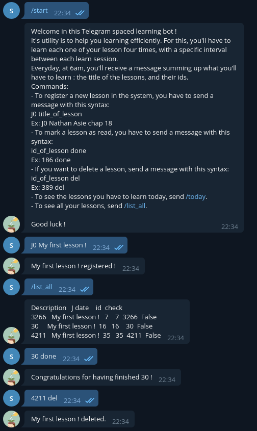

# Spaced learning Telegram bot
Spaced Learning algorithm working through a Telegram bot.

You'll find it at https://t.me/SpacedLearning_bot !

## What it does :

You can add the title of the lessons you want to learn through a simple command.
You'll have a reminder to learn it again 7, 16 and 35 days after !

## How to use it :




## Run on your own server :

If you want to run the software on your own server, juste download the files, create your own bot with https://t.me/BotFather and run :
```
cd spaced_learning
python3 main.py
```

Good luck in your learning sessions !
